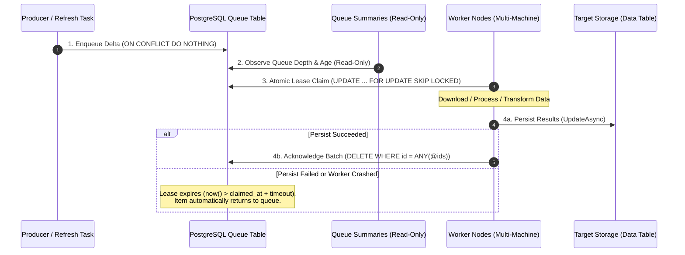

# AI Guidelines: PostgreSQL Distributed Queue Processing

**Environment:** PostgreSQL 15+ / 18, Npgsql, ASP.NET Core, .NET 9.0+, C# 10+.  
**Domain:** Distributed background processing, multi-machine bulk updates, resilient claim/acknowledge queues, and GIS data pipelines (`DiGi.PostgreSQL`, `DiGi.GIS.PostgreSQL`, `DiGi.GIS.WebAPI`).

---

## 1. Architectural Overview & Workflow

When processing millions of records across multiple machines (e.g., downloading orthophotos/satellite imagery for building footprints, running ML inference, or performing heavy geometric transformations), updating records directly in monolithic loops or fetching items with immediate deletion causes catastrophic failure modes.

### 🚫 The Destructive Drain Anti-Pattern
A naive implementation reads and removes work in a single step (`DELETE FROM queue ... RETURNING ...`).
- **Work is lost on failure:** If a worker crashes, times out, loses network connectivity, or fails during downstream processing, the deleted rows are gone permanently.
- **The queue is unobservable:** A queue that deletes on read cannot be inspected. Administrators and monitoring tools cannot measure queue depth, track age, or detect stalled partitions without draining the queue.

### The 4-Stage Claim/Acknowledge Pipeline
The DiGi distributed queue architecture separates data staging from destructive consumption using a robust four-stage lifecycle:



1. **Enqueue / Refresh:** The producer identifies missing or outdated records across partitions, preparing delta records and inserting them into the queue with `ON CONFLICT DO NOTHING` for idempotency.
2. **Observe:** Read-only summary endpoints report queue depth, age distribution, and partition statistics without claiming or modifying rows.
3. **Atomic Claim:** Workers lease batches non-destructively by setting `claimed_at = now()` using `FOR UPDATE SKIP LOCKED`.
4. **Two-Phase Acknowledge:** After successfully storing the computed results into the target table, the worker explicitly deletes the completed queue IDs. If a failure occurs, acknowledgment is skipped, and the expired lease returns the item to the queue automatically.

---

## 2. Queue Table Schema & Index Standards

Update queue tables are stored as single unpartitioned tables named `{TargetTable}_{EntityType}_update` (e.g., `orto_datas_building_2d_reference_update`).

### Standard DDL Definition
The DDL method in `Create/TableAsync.cs` must define the table with both creation and migration statements:

```sql
CREATE TABLE IF NOT EXISTS {tableName} (
    id BIGINT GENERATED ALWAYS AS IDENTITY,
    county_id INT NOT NULL,
    reference TEXT NOT NULL,
    subdivision_id INT,
    created_at timestamptz DEFAULT now(),
    claimed_at timestamptz,
    PRIMARY KEY (id, county_id)
);

-- Backward-compatible column migration for existing databases
ALTER TABLE {tableName} ADD COLUMN IF NOT EXISTS claimed_at timestamptz;

-- Prevent duplicate queuing of the same entity within a partition
CREATE UNIQUE INDEX IF NOT EXISTS idx_{tableName}_county_id_reference
    ON {tableName} (county_id, reference);

-- FIFO ordering index for queue processing
CREATE INDEX IF NOT EXISTS idx_{tableName}_created_at
    ON {tableName} (created_at ASC);

-- Optimized index for claiming unclaimed or expired items
CREATE INDEX IF NOT EXISTS idx_{tableName}_claimed_at
    ON {tableName} (claimed_at ASC NULLS FIRST, created_at ASC);
```

### Key Schema Rules
1. **`id BIGINT GENERATED ALWAYS AS IDENTITY`:** Serves as the unique identity handle passed back to workers and used for explicit batch deletion.
2. **`claimed_at timestamptz` (Nullable):** `NULL` indicates the item is ready to be processed. A timestamp indicates an active lease.
3. **`UNIQUE (county_id, reference)`:** Enforces that a refresh run appending tens of thousands of references never enqueues duplicates.
4. **Composite Claim Index:** `(claimed_at ASC NULLS FIRST, created_at ASC)` allows PostgreSQL to quickly scan for unclaimed items (`NULLS FIRST`) or expired leases in FIFO creation order.

---

## 3. Atomic Lease Claiming (`FOR UPDATE SKIP LOCKED`)

### The Claim SQL Statement
Claiming rows must be atomic, non-blocking for concurrent workers, and non-destructive:

```sql
UPDATE {TableName.OrtoDatas_Building2DReference_Update}
SET claimed_at = now()
WHERE id IN (
    SELECT id FROM {TableName.OrtoDatas_Building2DReference_Update}
    WHERE claimed_at IS NULL OR claimed_at < now() - (@claimTimeoutMinutes * interval '1 minute')
    ORDER BY created_at ASC
    FOR UPDATE SKIP LOCKED
    LIMIT @count
)
RETURNING id, county_id, reference, subdivision_id;
```

### Critical Mechanics & Gotchas
- **`FOR UPDATE SKIP LOCKED`:** Tells PostgreSQL to skip any rows currently locked by other concurrent worker transactions rather than waiting. This allows dozens of worker machines to pull batches simultaneously without lock contention or duplicate work.
- **Lease Timeout via Native Arithmetic:** Use `(@claimTimeoutMinutes * interval '1 minute')` rather than string concatenation (`(@claimTimeoutMinutes || ' minutes')::interval`). In PostgreSQL, integer multiplication with an `interval` is native and prevents syntax or type-casting errors.
- **Re-Queueing on Crash:** If a worker machine dies or drops network connection, the lease expires when `now() - claimed_at > claimTimeoutMinutes`. The next claiming worker will automatically pick up the abandoned rows.

### Converter Method Signature Standard
```csharp
public static async Task<List<Building2DReference>?> GetNextBuilding2DReferencesAsync(
    NpgsqlConnection? npgsqlConnection,
    int count = 100,
    int claimTimeoutMinutes = 30,
    int commandTimeout = 60,
    CancellationToken cancellationToken = default)
```
- Expose both `static` (accepting `NpgsqlConnection?`) and instance extension methods.
- Always thread `cancellationToken` and apply `commandTimeout` to `NpgsqlCommand`.

---

## 4. Two-Phase Processing & Batch Acknowledgment

Workers must explicitly acknowledge successfully processed items by deleting their queue IDs.

### Acknowledgment SQL Statement
```sql
DELETE FROM {TableName.OrtoDatas_Building2DReference_Update}
WHERE id = ANY(@ids);
```

### Converter Implementation Pattern
```csharp
public static async Task<long> AcknowledgeBuilding2DReferencesAsync(
    NpgsqlConnection? npgsqlConnection,
    IEnumerable<long>? ids,
    int commandTimeout = 60,
    CancellationToken cancellationToken = default)
{
    if (npgsqlConnection is null || ids is null)
    {
        return -1;
    }

    long[] ids_Array = [.. ids];
    if (ids_Array.Length == 0)
    {
        return 0;
    }

    if (!await DiGi.PostgreSQL.Query.TableExistsAsync(npgsqlConnection, TableName.OrtoDatas_Building2DReference_Update))
    {
        return 0;
    }

    string commandText = $@"
        DELETE FROM {TableName.OrtoDatas_Building2DReference_Update}
        WHERE id = ANY(@ids);";

    try
    {
        await using NpgsqlCommand command = new(commandText, npgsqlConnection);
        command.CommandTimeout = commandTimeout;
        command.Parameters.Add(new NpgsqlParameter("ids", NpgsqlDbType.Array | NpgsqlDbType.Bigint) { Value = ids_Array });

        return await command.ExecuteNonQueryAsync(cancellationToken);
    }
    catch (NpgsqlException npgsqlException)
    {
        Serilog.Modify.Log(npgsqlException, "{Method} failed while acknowledging {Count} references", nameof(AcknowledgeBuilding2DReferencesAsync), ids_Array.Length);
        return -1;
    }
}
```

### The Golden Rule of Acknowledgment
> **NEVER acknowledge items before their target data is committed.**
> Acknowledgment belongs strictly *after* `UpdateAsync` / storage commit succeeds. If saving fails or throws, skip acknowledgment so the lease expires and the work is safely retried.

---

## 5. Non-Destructive Queue Observation

Distributed queues must be observable without modifying state or disturbing worker nodes.

### Query Implementation Pattern
```csharp
public static async Task<List<OrtoDatasQueueResult>?> GetQueueSummariesByCountyIdsAsync(
    NpgsqlConnection? npgsqlConnection,
    IEnumerable<int>? countyIds,
    int commandTimeout = 600,
    CancellationToken cancellationToken = default)
{
    if (npgsqlConnection is null)
    {
        return null;
    }

    if (!await DiGi.PostgreSQL.Query.TableExistsAsync(npgsqlConnection, TableName.OrtoDatas_Building2DReference_Update))
    {
        return null;
    }

    int[]? countyIds_Array = countyIds is null ? null : [.. countyIds];

    string commandText = $@"
        SELECT
            county_id,
            COUNT(*),
            COUNT(*) FILTER (WHERE subdivision_id IS NOT NULL),
            MIN(created_at), MAX(created_at)
        FROM {TableName.OrtoDatas_Building2DReference_Update}
        {(countyIds_Array is null ? string.Empty : "WHERE county_id = ANY(@countyIds)")}
        GROUP BY county_id
        ORDER BY county_id;";

    await using NpgsqlCommand npgsqlCommand = new(commandText, npgsqlConnection);
    npgsqlCommand.CommandTimeout = commandTimeout;
    if (countyIds_Array is not null)
    {
        npgsqlCommand.Parameters.Add(new NpgsqlParameter("countyIds", NpgsqlDbType.Array | NpgsqlDbType.Integer) { Value = countyIds_Array });
    }

    List<OrtoDatasQueueResult> result = [];
    await using NpgsqlDataReader npgsqlDataReader = await npgsqlCommand.ExecuteReaderAsync(cancellationToken);
    while (await npgsqlDataReader.ReadAsync(cancellationToken))
    {
        result.Add(new OrtoDatasQueueResult(
            npgsqlDataReader.GetInt32(0),
            npgsqlDataReader.GetInt64(1),
            npgsqlDataReader.GetInt64(2),
            npgsqlDataReader.IsDBNull(3) ? null : npgsqlDataReader.GetFieldValue<DateTimeOffset>(3),
            npgsqlDataReader.IsDBNull(4) ? null : npgsqlDataReader.GetFieldValue<DateTimeOffset>(4)));
    }

    return result;
}
```

### Summary Requirements
- Group by partition/scope (e.g. `county_id`).
- Report total count (`COUNT(*)`), filtered counts (e.g. `COUNT(*) FILTER (...)`), and oldest/newest timestamps (`MIN(created_at)`, `MAX(created_at)`).
- An empty result or `404 NotFound` indicates the queue is drained or not initialized.

---

## 6. WebAPI Controller & Client Endpoints

### Controller Endpoints
Controllers expose two endpoints for queue interaction:

```csharp
[HttpPost("nextbuilding2dreferences", Name = $"{nameof(OrtoDatasController)}_{nameof(NextBuilding2DReferencesAsync)}")]
[ProducesResponseType(typeof(List<Building2DReference>), StatusCodes.Status200OK)]
[ProducesResponseType(StatusCodes.Status204NoContent)]
[ProducesResponseType(StatusCodes.Status400BadRequest)]
public async Task<IActionResult> NextBuilding2DReferencesAsync(
    [FromQuery(Name = "count")] int count = 100,
    [FromQuery(Name = "claimtimeoutminutes")] int claimTimeoutMinutes = 30,
    CancellationToken cancellationToken = default)
{
    if (count <= 0) return BadRequest("Count must be greater than 0.");
    if (claimTimeoutMinutes <= 0) return BadRequest("Claim timeout minutes must be greater than 0.");
    if (ortoDatasPostgreSQLConverter is null) return BadRequest();

    List<Building2DReference>? references = await ortoDatasPostgreSQLConverter.GetNextBuilding2DReferencesAsync(
        count, claimTimeoutMinutes, cancellationToken: cancellationToken);

    if (references is null || references.Count == 0) return NoContent();

    return Content(Core.Convert.ToSystem_String(references) ?? string.Empty, "application/json");
}

[HttpPost("acknowledgebuilding2dreferences", Name = $"{nameof(OrtoDatasController)}_{nameof(AcknowledgeBuilding2DReferencesAsync)}")]
[ProducesResponseType(typeof(long), StatusCodes.Status200OK)]
[ProducesResponseType(StatusCodes.Status400BadRequest)]
[ProducesResponseType(StatusCodes.Status500InternalServerError)]
public async Task<IActionResult> AcknowledgeBuilding2DReferencesAsync(
    [FromBody] IEnumerable<long>? ids,
    CancellationToken cancellationToken = default)
{
    if (ids is null || !ids.Any()) return BadRequest("The ids collection cannot be null or empty.");
    if (ortoDatasPostgreSQLConverter is null) return BadRequest();

    long count_Deleted = await ortoDatasPostgreSQLConverter.AcknowledgeBuilding2DReferencesAsync(ids, cancellationToken: cancellationToken);
    if (count_Deleted < 0) return StatusCode(500, "Internal server error during acknowledgement");

    return Ok(count_Deleted);
}
```

### Worker / Background Task Loop
```csharp
while (postResponse_References?.Result is List<Building2DReference> references && references.Count > 0)
{
    cancellationToken.ThrowIfCancellationRequested();

    // 1. Process batch
    List<OrtoDatas> processedData = await ProcessBatchAsync(references, cancellationToken);

    // 2. Persist to storage
    bool saved = await TargetConverter.UpdateAsync(processedData);

    // 3. Acknowledge only on success
    if (saved)
    {
        List<long> ids = [.. references.Where(x => x.Id > 0).Select(x => x.Id)];
        if (ids.Count > 0)
        {
            await AcknowledgeAsync(ids, cancellationToken);
        }
    }

    // 4. Fetch next batch
    postResponse_References = await FetchNextBatchAsync(cancellationToken);
}
```

---

## 7. Implementation Checklist

When implementing a new distributed queue in DiGi solutions, verify:

- [ ] Queue table schema includes `claimed_at timestamptz` and migration statement?
- [ ] Unique constraint on `(partition_id, reference)` prevents duplicate queuing?
- [ ] Composite index on `(claimed_at ASC NULLS FIRST, created_at ASC)` created?
- [ ] Claim statement uses `FOR UPDATE SKIP LOCKED` and native interval multiplication (`@minutes * interval '1 minute'`)?
- [ ] Claim method accepts `count`, `claimTimeoutMinutes`, `commandTimeout`, and `CancellationToken`?
- [ ] Acknowledge method deletes by ID array (`WHERE id = ANY(@ids)`)?
- [ ] Workers invoke acknowledgment **only after** storage write completes successfully?
- [ ] Read-only observation endpoint (`queuesummaries...`) exists and does not drain the queue?
- [ ] All public methods and endpoints have comprehensive XML documentation?
