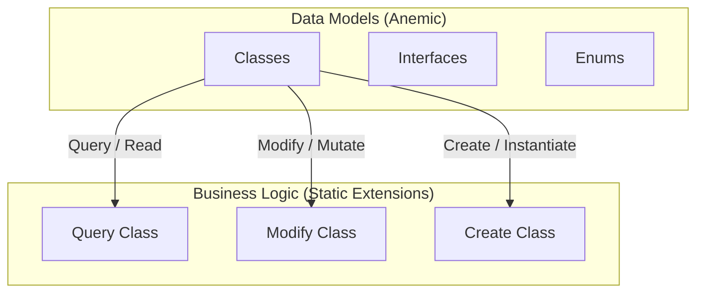

# DiGi.YOLO

**DiGi.YOLO** is a C# engineering and architectural software library suite designed for BIM and CAD integrations (such as Revit, RhinoCommon, Grasshopper, and Dynamo BIM).

---

## 🏗️ Project Architecture & Assemblies

The repository contains the following core components and assemblies:
* **[DiGi.YOLO](DiGi.YOLO)** (Path: `DiGi.YOLO\DiGi.YOLO`)

---

## 📐 Core Architectural Pattern (DiGi.Core Pattern)

This project strictly separates **Data Models** (anemic schemas) from **Business/Calculation Logic** (static extension methods). All new features must strictly follow this pattern.



### 1. Data Models (Classes, Interfaces, Enums)
* **Classes:** Place in the `/Classes` directory (Namespace: `[Project].Classes`). Keep them simple and lightweight (properties and basic constructors only). **Do NOT** put complex logic inside these classes.
* **Interfaces:** Place in the `/Interfaces` directory (Namespace: `[Project].Interfaces`).
* **Enums:** Place in the `/Enums` directory (Namespace: `[Project].Enums`).

### 2. Business Logic (Extension Methods)
ALL complex functionalities, including operations on classes, interfaces, and enums, MUST be implemented as **Extension Methods** inside static partial classes in `/Query`, `/Modify`, or `/Create` directories:
* **Query (Read/Extract):** Static partial class `Query` returning results based on a query without modifying the source object.
* **Modify (Update/Mutate):** Static partial class `Modify` modifying the state or properties of the existing object in place.
* **Create (Instantiate):** Static partial class `Create` instantiating and returning a new object.

---

## 💻 Coding Guidelines for Developers & AI Agents

To maintain codebase health, performance, and compatibility within Visual Studio 2026 / C# 10+ environments, all developers and AI agents must strictly comply with these guidelines.

### 1. General Coding Standards
1. **English Only (Code):** All generated code MUST use English naming conventions.
2. **English Only (Comments):** All code comments MUST be in English.
3. **Explicit Typing Mandatory:** Strictly avoid implicit typing (`var`). You must use explicit variable types everywhere, unless implicit typing is absolutely enforced by the compiler (e.g., when returning anonymous types).
   * **Target-Typed New (`new(...)`):** To avoid IDE0090 analyzer messages, always use target-typed new expressions (`new(...)`) instead of explicit type instantiation when the target type is explicitly declared (e.g., write `PointNode pointNode = new();` instead of `PointNode pointNode = new PointNode();`).
   * **Collection Expressions (`[]`):** To avoid IDE0028 analyzer messages ("Collection initialization can be simplified"), use collection expressions (`[]`) for initializing collections (e.g., write `List<int> numbers = [];` or `int[] array = [1, 2, 3];` instead of `new List<int>()` or `new int[] { 1, 2, 3 }`).
4. **Variable Naming Convention:** Variable and object names inside methods and functions MUST start with the object's type name formatted in camelCase. If a more specific name is needed, append a descriptive part after an underscore (`_`). 
   * *Complex Type Examples:* `PointNode pointNode_Base`, `PointNode pointNode_Temp`.
   * **Plural Naming for Collections:** For collections (such as `IEnumerable`, `List`, `Array`, `HashSet`, etc., including properties and variables), do NOT prefix them with the collection type name (e.g., do not use `listConditions` or `arrayGroups`). Instead, keep the full name of the object/type and append the plural suffix (e.g., use `FilterConditions` instead of `Conditions` or `listConditions`, and `FilterGroups` instead of `Groups` or `listGroups`). This rule applies because the collection contains elements of that specific object type.
   * **Property Naming matching Value Type:** In case a value type is fully descriptive and it is unique across a class, try to keep the property name as the value type it represents (e.g., `public AggregateFunction AggregateFunction { get; set; }`).
   * **Exception for Primitive/Simple Types:** For simple types like `double`, `string`, `int`, `bool`, etc., it is acceptable to exclude the type prefix and use standard camelCase naming.
   * *Primitive Type Examples:* `double tolerance`, `string name`, `int count`.
5. **Zero Warnings & Messages:** The generated code MUST NOT produce any compiler warnings or analyzer messages in Visual Studio. Ensure strict adherence to nullability rules, proper parameter validations, and clean code principles.
6. **Language Version (C# 10+):** Assume `LangVersion` is 10.0 or higher. You may use modern C# features (such as file-scoped namespaces, enhanced pattern matching, etc.) provided they align with the project's architectural constraints.
---

---

### 2. Architecture & Project Structure (DiGi.Core Pattern)
This project strictly separates data models from business logic using Anemic Models and Static Extension Methods. You MUST follow this structure for all new features.

### 1. Data Models (Classes, Interfaces, Enums)
- **Classes:** Place in the `/Classes` directory (Namespace: `[Project].Classes`). Keep them simple and lightweight (properties and basic constructors only). **Do NOT** put complex logic inside these classes.
- **Interfaces:** Place in the `/Interfaces` directory (Namespace: `[Project].Interfaces`).
- **Enums:** Place in the `/Enums` directory (Namespace: `[Project].Enums`).

### 2. Business Logic (Extension Methods)
ALL complex functionalities, including operations on classes, interfaces, and enums, MUST be implemented as **Extension Methods** inside one of three specific static partial classes. Do not create new manager/service classes. 

* **Query (Read/Extract):**
    * **Directory:** `/Query`
    * **Class:** `public static partial class Query`
    * **Purpose:** Complex functionalities that return a result based on a query. Does NOT modify the source object (e.g., translating dynamic filter groups into SQL/parameterized commands).
* **Modify (Update/Mutate):**
    * **Directory:** `/Modify`
    * **Class:** `public static partial class Modify`
    * **Purpose:** Complex functionalities that modify the state or properties of the existing object.
* **Create (Instantiate):**
    * **Directory:** `/Create`
    * **Class:** `public static partial class Create`
    * **Purpose:** Complex functionalities that create and return a completely new object based on input data.

---

---

### 3. XML Documentation Standards
All public constructors, properties, methods, and enum values must be fully documented using XML comments:
* **Code Preservation & Doc Synchronization:** DO NOT edit, refactor, or restructure the underlying C# logic. Your edits are strictly limited to XML documentation comments (`///`). You must add missing tags AND evaluate existing documentation. If existing XML comments are outdated, inaccurate, or describe logic/parameters that no longer exist, you MUST rewrite them to reflect the current code accurately.
* **Explicit Typing:** Use explicit typing only. Avoid the `var` keyword in any code snippets you handle.
* **Partial Classes:** Do NOT add `<summary>` to the class declaration if marked `partial`. Document only the members within.
* **Exhaustive Coverage:** Zero-tolerance for skipped public members. Every public member must have an accurate, up-to-date description.
* **Quality over Speed:** Focus on output quality, accuracy, and deep alignment with the code's actual behavior, not on task completion speed.
* **Reference Context (XML Documentation):** To maximize the quality and accuracy of the generated documentation, you must actively search for and utilize existing XML documentation from referenced libraries:
   * For every referenced library used in the project, locate its corresponding XML documentation file.
   * The XML file will share the identical base name as the referenced file (e.g., `LibraryName.dll` -> `LibraryName.xml`) and is located in the exact same directory as the reference.
   * Ingest the context from these XML files to ensure accurate cross-referencing, correct terminology, and precise descriptions of external types and method parameters.
* **Warning-Free Code (Signature Matching):** Ensure that the generated or updated documentation strictly matches method signatures. Remove `<param>` tags for parameters that no longer exist in the method signature. Add missing `<param>` tags for new parameters. Validate that all parameters, return types (`<returns>`), and type parameters (`<typeparam>`) are correctly and exhaustively documented to prevent XML documentation warnings (e.g., `CS1591`, `CS1573`).
* **Single Summary Enforcement:** Strictly verify that each element (class, enum, method, property, field) receives exactly ONE `<summary>` block. When updating existing docs, overwrite the old `<summary>` completely instead of appending a new one. Duplicate tags for the same member are strictly forbidden. Perform a final validation pass on the generated XML structure to remove any redundant tags before outputting the code.
* **No Empty Lines:** Strictly avoid empty lines within the XML documentation blocks (e.g., aempty line or line containing only `///`). Empty lines cause incorrect tooltip formatting and rendering issues in Visual Studio IntelliSense. If a paragraph break is necessary for readability, use the `<para>` tag instead.

* **INCORRECT (Do NOT do this):**
     ```csharp
     /// <summary>
     /// Calculates the total volume of the selected Revit elements.
     
     /// This operation might take a while on large BIM models.
     /// </summary>
     public double CalculateVolume(List<Element> list_Elements)
     ```
   
   * **CORRECT (Do this instead):**
     ```csharp
     /// <summary>
     /// Calculates the total volume of the selected Revit elements.
     /// <para>This operation might take a while on large BIM models.</para>
     /// </summary>
     public double CalculateVolume(List<Element> list_Elements)
     ```

---

---

### 4. API Reference Documentation Locating
To minimize token consumption and avoid parsing full implementation files, you MUST consult the generated Markdown documentation first when exploring type schemas, namespaces, and public API interfaces:
To minimize token consumption and avoid parsing full implementation files, you MUST consult the generated Markdown documentation first when exploring type schemas, namespaces, and public API interfaces.

* **API Docs Path**: Look in the `documentation/API/[AssemblyName]/` directory of each active workspace.
* **Fallback**: If the `documentation/API/` folder does not exist, fall back to scanning standard C# source files and `/bin/*.xml` files.
* **Structure**: Each assembly has its own directory. Inside, files are split by **Namespace** (e.g., `DiGi.Core.Classes.md`).
* **Content**: These files contain exact signatures and `<summary>` descriptions of all public classes, constructors, methods, properties, and enums.

---

### 5. Serialization Pattern (SerializableObject / ISerializableObject)
Classes under `/Classes` that need JSON persistence, cloning, or polymorphic deserialization MUST inherit `DiGi.Core.Classes.SerializableObject` and follow this exact shape. This is reflection-driven — there is no manual JSON parsing.

1. **Marker interfaces:** Each project that adds serializable classes should define its own pair of marker interfaces under `/Interfaces`, mirroring `DiGi.GIS.Interfaces.IGISObject` / `IGISSerializableObject`:
   ```csharp
   // /Interfaces/I<Project>Object.cs
   public interface I<Project>Object : DiGi.Core.Interfaces.IObject
   {
   }

   // /Interfaces/I<Project>SerializableObject.cs
   public interface I<Project>SerializableObject : I<Project>Object, DiGi.Core.Interfaces.ISerializableObject
   {
   }
   ```
   Every serializable class in the project implements `I<Project>SerializableObject` (e.g. `public class Holiday : SerializableObject, IEPWSerializableObject`).

2. **Fields:** `private readonly` fields, each tagged `[JsonInclude, JsonPropertyName(nameof(PublicPropertyName))]` — always reference the public property name via `nameof(...)`, never a hardcoded string literal.

3. **Three constructors, always in this order:**
   - The primary constructor (plain parameters, assigns fields) — no `base(...)` call needed.
   - A **copy constructor** `ClassName(ClassName? classNameInstance) : base(classNameInstance)` that copies every field:
     - Primitive/value-type fields and strings: copy by value directly.
     - `List<T>`/`IList<T>` of **primitives**: copy with `new List<T>(source)` (or `null` if source is `null`).
     - `IList<T>` of **nested `SerializableObject`-derived items**: clone element-by-element, filtering nulls, e.g.:
       ```csharp
       if (source.items != null)
       {
           items = [];
           foreach (Item item in source.items)
           {
               if (Core.Query.Clone(item) is Item item_Temp)
               {
                   items.Add(item_Temp);
               }
           }
       }
       ```
       (Do not use the `IEnumerable<T>.Clone<T>()` extension directly into an `IList<T>` field — it returns `List<T?>?`, which is a nullable-element mismatch against a non-nullable `IList<T>` field.)
     - A single nested `SerializableObject` reference: `field = Core.Query.Clone(source.field);`.
   - A **JSON constructor** `ClassName(JsonObject? jsonObject) : base(jsonObject)` — pure delegation, body stays empty.

4. **Properties:** `[JsonIgnore]` get-only properties returning the backing field (do not also serialize through the property — the field attribute handles it).

5. **Project file:** the project's `.csproj` needs a `<Reference Include="DiGi.Core"><HintPath>..\..\DiGi.Core\bin\DiGi.Core.dll</HintPath></Reference>` and a `<PackageReference Include="System.Text.Json" .../>` matching the version used elsewhere in the solution (check `DiGi.Core.csproj` for the current version).

### Example — simple class with primitive fields (`/Classes/Holiday.cs`)
```csharp
using DiGi.Core.Classes;
using DiGi.EPW.Interfaces;
using System.Text.Json.Nodes;
using System.Text.Json.Serialization;

namespace DiGi.EPW.Classes
{
    public class Holiday : SerializableObject, IEPWSerializableObject
    {
        [JsonInclude, JsonPropertyName(nameof(Name))]
        private readonly string? name;

        [JsonInclude, JsonPropertyName(nameof(Date))]
        private readonly string? date;

        public Holiday(string? name, string? date)
        {
            this.name = name;
            this.date = date;
        }

        public Holiday(Holiday? holiday)
            : base(holiday)
        {
            if (holiday != null)
            {
                name = holiday.name;
                date = holiday.date;
            }
        }

        public Holiday(JsonObject? jsonObject)
            : base(jsonObject)
        {
        }

        [JsonIgnore]
        public string? Name
        {
            get
            {
                return name;
            }
        }

        [JsonIgnore]
        public string? Date
        {
            get
            {
                return date;
            }
        }
    }
}
```

### Example — class holding a nested list of `SerializableObject` items (copy constructor excerpt)
```csharp
public HolidaysDaylightSaving(HolidaysDaylightSaving? holidaysDaylightSaving)
    : base(holidaysDaylightSaving)
{
    if (holidaysDaylightSaving != null)
    {
        leapYearObserved = holidaysDaylightSaving.leapYearObserved;

        if (holidaysDaylightSaving.holidays != null)
        {
            holidays = [];
            foreach (Holiday holiday in holidaysDaylightSaving.holidays)
            {
                if (Core.Query.Clone(holiday) is Holiday holiday_Temp)
                {
                    holidays.Add(holiday_Temp);
                }
            }
        }
    }
}
```

### Example — class holding a `List<double>` of primitives (copy constructor excerpt)
```csharp
public GroundTemperature(GroundTemperature? groundTemperature)
    : base(groundTemperature)
{
    if (groundTemperature != null)
    {
        depth = groundTemperature.depth;
        monthlyValues = groundTemperature.monthlyValues == null ? null : new List<double>(groundTemperature.monthlyValues);
    }
}
```

---

### 6. Automatic Tests (xUnit)
1. **Test Project Separation:** The test projects follow the naming convention `[ProjectName].xUnit` (e.g., `DiGi.Core.xUnit`, `DiGi.Geometry.xUnit`).
2. **Partial Test Class (`Facts`):** All test methods in a test project must be defined inside the `public partial class Facts` class. This groups all tests under a single shared class per namespace.
3. **Directory Structure:** Place test files inside the `/Facts` directory of the test project.
4. **Namespace Convention:** The namespace of the test file must match the test project namespace (e.g., `namespace DiGi.Core.xUnit` or `namespace DiGi.Geometry.xUnit`).
5. **Global Usings:** The namespace `Xunit` is globally imported via project configuration. Do NOT add `using Xunit;` to the top of test files.
6. **Attributes:** Use the `[Fact]` attribute to mark test methods.
7. **Method Naming:** Name test methods after the class, property, or method under test (e.g., `public void Color()`, `public void PlanarIntersectionResult_Performance()`).
8. **XML Documentation for Tests:**
   * Every test method MUST have a `<summary>` documentation block detailing what is being tested.
   * Strictly avoid empty lines within the XML documentation blocks (e.g., an empty line or a line containing only `///`). Empty lines cause tooltip rendering issues in Visual Studio.
   * If a paragraph break is necessary, use the `<para>` tag.

#### 📂 Shared Test Data Files (Fixtures)
When a test needs an on-disk input file (sample `.gmf`, `.json`, `.epw`, etc.), there is **one shared `files` directory used by every test project** — do NOT add a per-project data folder.

1. **Location:** `DiGi.Test/files/` (relative to the `DigiProject` workspace root, where all the `DiGi.*` repos sit side by side). From inside any test project directory `DiGi.Test/<ProjectName>.xUnit/`, the relative path is `../files/`. The test repo root is the `DiGi.Test` solution folder (contains `DiGi.Test.slnx`); this guideline lives in the separate `DiGi.Maintenance` repo, so the path is given relative to the common workspace root rather than to this file.
2. **Adding a fixture:** Drop the file straight into `DiGi.Test/files/` and reference it by file name only. Files are read **in place** from the repo (they are NOT copied to the build output), so no `<None CopyToOutputDirectory>` entry is needed.
3. **Resolving the path in a test:** Use the helper `Core.xUnit.Query.FilePath(System.Reflection.Assembly.GetExecutingAssembly(), "<fileName>")`, which returns the absolute path to `DiGi.Test/files/<fileName>`. For the directory itself, use the extension `assembly.FilesDirectory()`. Both live in `DiGi.Core.xUnit/Query/` (`FilePath.cs`, `FilesDirectory.cs`) and resolve `DiGi.Test/files` by walking up from the test assembly's `bin/<ProjectName>.xUnit/` output folder. `FilePath` already `Assert`s the directory resolves, so a `null`/missing result fails the test cleanly.
4. **Namespace resolution:** Call it as `Core.xUnit.Query.FilePath(...)` with no `using` — it resolves via the same innermost-enclosing-namespace lookup as `Core.xUnit.Query.SerializationCheck(...)`, as long as the test namespace nests under `DiGi`. Add `using System.Reflection;` (or fully qualify `Assembly`).
5. **Example:**
   ```csharp
   using System.Reflection;
   // ...
   string? path = Core.xUnit.Query.FilePath(Assembly.GetExecutingAssembly(), "0207_GML.gmf");
   Assert.False(string.IsNullOrWhiteSpace(path));
   Assert.True(System.IO.File.Exists(path));
   ```
   Existing references for this pattern: `DiGi.GIS.xUnit/Facts/OrtoDatas.cs`, `DiGi.EPW.xUnit/Facts/EPWFile.cs`, `DiGi.Geometry.xUnit/Facts/InRange.cs`.
6. **Large binary fixtures:** Files like `.gmf` can be multi-megabyte. They are tracked by git (not ignored); prefer a representative-but-minimal sample, and consider Git LFS if size becomes a concern.

---

### 7. Branch Synchronization & Versioning Protocol
1. **Version Format:** Execute this workflow ONLY if the currently active branch follows the exact Semantic Versioning format of `*.*.*` (e.g., `0.8.2`, `1.12.0`). If the branch name contains text, prefixes, or suffixes (e.g., `feature/login`, `v0.8.2`, `0.8.2-beta`, `main`), DO NOT execute this protocol.
2. **Branch Differences:** Before selecting repositories to synchronize, compare the active branch with the `main` branch. Carry out the update process ONLY for repositories that have differences between the active branch and `main`. Skip any repository where the active branch and `main` are identical.

#### 🔄 Synchronization Workflow (Execution Steps)
If the trigger conditions are met, perform the following steps sequentially for the applicable repositories:

1. **Synchronize with Main:** Synchronize the active version branch with the `main` branch so that both branches contain the exact same codebase. This typically involves merging the current version branch into `main` and ensuring no pending diffs remain.
2. **Calculate Next Version (Patch Bump):** Increment the third digit (patch version) of the current branch name by exactly `1`. 
   *Example:* If the current active branch is `0.8.2`, the target version becomes `0.8.3`.
3. **Create New Branch:** Create a new branch off `main` using the target version name calculated in Step 2.
4. **Update Version in Directory.Build.props:** If a `Directory.Build.props` file exists in the repository, update the `<Major>`, `<Minor>`, and `<Build>` XML tags to match the components of the new branch version (e.g., for branch `0.8.1`, set `<Major>0</Major>`, `<Minor>8</Minor>`, `<Build>1</Build>`). Commit this change on the new branch before pushing.
5. **Publish to GitHub & Set Upstream:** Push both the updated `main` branch and the newly created version branch to the remote repository on GitHub (origin). Use the `--set-upstream` (or `-u`) flag when pushing the new version branch so that it tracks properly and displays standard synchronization options in GitHub Desktop (e.g., `git push -u origin <version_branch>`).
