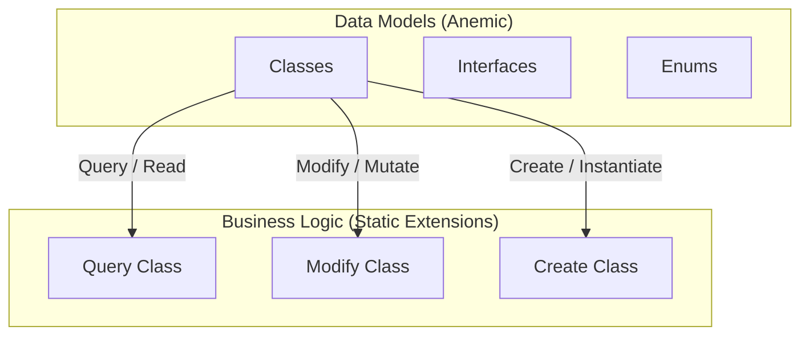

# DiGi.YOLO

**DiGi.YOLO** is a C# engineering and architectural software library suite designed for BIM and CAD integrations (such as Revit, RhinoCommon, Grasshopper, and Dynamo BIM).

---

## 🏗️ Project Architecture & Assemblies

The repository contains the following core components and assemblies:
* **[DiGi.YOLO](DiGi.YOLO)** (Path: `DiGi.YOLO\DiGi.YOLO`)

---

## 📐 Core Architectural Pattern (DiGi.Core Pattern)

This project strictly separates **Data Models** (anemic schemas) from **Business/Calculation Logic** (static extension methods). All new features must strictly follow this pattern.

### 1. Data Models (Classes, Interfaces, Enums)
* **Classes:** Place in the `/Classes` directory (Namespace: `[Project].Classes`). Keep them simple and lightweight (properties and basic constructors only). **Do NOT** put complex logic inside these classes.
* **Interfaces:** Place in the `/Interfaces` directory (Namespace: `[Project].Interfaces`).
* **Enums:** Place in the `/Enums` directory (Namespace: `[Project].Enums`).

### 2. Business Logic (Extension Methods)
ALL complex functionalities, including operations on classes, interfaces, and enums, MUST be implemented as **Extension Methods** inside static partial classes in `/Query`, `/Modify`, or `/Create` directories:
* **Query (Read/Extract):** Static partial class `Query` returning results based on a query without modifying the source object.
* **Modify (Update/Mutate):** Static partial class `Modify` modifying the state or properties of the existing object in place.
* **Create (Instantiate):** Static partial class `Create` instantiating and returning a new object.

---

## 💻 Coding Guidelines for Developers & AI Agents

To maintain codebase health, performance, and compatibility:

1. **English Only (Code & Comments):** All generated code and comments MUST be strictly in English.
2. **Explicit Typing Mandatory:** Never use implicit typing (`var`) unless it is strictly required by the compiler (declare all types explicitly).
3. **Variable Naming Convention:** Variable and object names inside methods and functions MUST start with the object's type name formatted in camelCase (e.g. `PointNode pointNode_Base`). If a more specific name is needed, append a descriptive part after an underscore (`_`).
   * **Plural Naming for Collections:** For collections (such as `IEnumerable`, `List`, `Array`, `HashSet`, etc.), do NOT prefix them with the collection type name (e.g., do not use `listConditions` or `arrayGroups`). Instead, keep the full name of the object/type and append the plural suffix (e.g., use `FilterConditions` instead of `Conditions` or `listConditions`).
   * **Exception for Primitive/Simple Types:** For simple types like `double`, `string`, `int`, `bool`, etc., it is acceptable to exclude the type prefix and use standard camelCase naming.
4. **Zero Warnings & Messages:** The generated code MUST NOT produce any compiler warnings or analyzer messages in Visual Studio. Ensure strict adherence to nullability rules, proper parameter validations, and clean code principles.
5. **Language Version (C# 10+):** Code should target C# 10.0 or higher.

---

## 📝 XML Documentation Protocol

All public constructors, properties, methods, and enum values must be fully documented using XML comments to ensure accurate IntelliSense:

1. **Local Doc Generation:** The local documentation generation MUST be handled by the MCP tool named `lm_studio` (using the **Gemma 4** model if available).
2. **Single Summary Rule:** Strictly verify that each element (class, enum, method, property, field) receives exactly ONE `
` block.
3. **No Empty Lines:** Strictly avoid empty lines within XML documentation blocks (e.g., `/// ` lines containing only whitespace). Use `<para>` tags for paragraph breaks if needed.
4. **Signature Matching:** Ensure XML comments match method signatures exactly. Remove/update `<param>` tags for parameters that no longer exist, and document all new parameters, return types (`<returns>`), and type parameters (`<typeparam>`) to prevent compiler warnings (e.g., `CS1591`, `CS1573`).
5. **Ingest External Context:** Actively search for and utilize existing XML documentation files (`LibraryName.xml`) next to referenced DLLs in the project to ensure correct cross-referencing and precise descriptions.

---

## 🔄 Branch Synchronization & Versioning Protocol

DevOps automation and branch versioning are controlled by strict versioning policies:

### Trigger Condition
- Protocol runs **ONLY** if the current active branch name matches the semantic versioning format of `*.*.*` exactly (e.g., `0.8.2`, `1.12.0`).
- If the branch contains suffixes/prefixes (e.g. `main`, `v0.8.2`, `0.8.2-beta`, `feature/xyz`), the protocol is skipped.

### Step-by-Step Workflow
1. **Sync with Main:** Merge the active version branch into `main` and resolve any diffs.
2. **Calculate Next Version (Patch Bump):** Increment the patch version (3rd digit) by exactly 1 (e.g., `0.8.2` becomes `0.8.3`).
3. **Create Branch:** Create a new branch named after the incremented version from the updated `main`.
4. **Update Project Version:** If a `Directory.Build.props` file exists in the repository, update the `<Major>`, `<Minor>`, and `<Build>` XML tags to match the new version. Commit this change to the new branch.
5. **Publish:** Push both the updated `main` branch and the new version branch to GitHub (`origin`).
