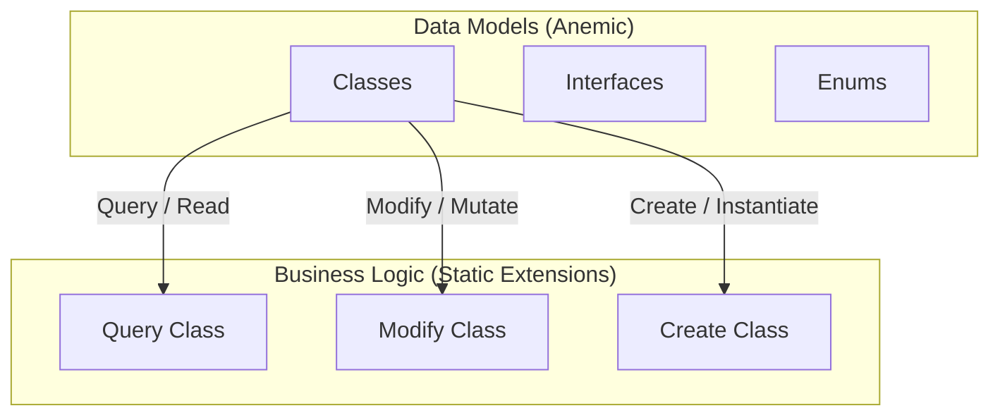

# DiGi.YOLO

**DiGi.YOLO** is a C# engineering and architectural software library suite designed for BIM and CAD integrations (such as Revit, RhinoCommon, Grasshopper, and Dynamo BIM).

---

## 🏗️ Project Architecture & Assemblies

The repository contains the following core components and assemblies:
* **[DiGi.YOLO](DiGi.YOLO)** (Path: `DiGi.YOLO\DiGi.YOLO`)

---

## 📐 Core Architectural Pattern (DiGi.Core Pattern)

This project strictly separates **Data Models** (anemic schemas) from **Business/Calculation Logic** (static extension methods). All new features must strictly follow this pattern.



### 1. Data Models (Classes, Interfaces, Enums)
* **Classes:** Place in the `/Classes` directory (Namespace: `[Project].Classes`). Keep them simple and lightweight (properties and basic constructors only). **Do NOT** put complex logic inside these classes.
* **Interfaces:** Place in the `/Interfaces` directory (Namespace: `[Project].Interfaces`).
* **Enums:** Place in the `/Enums` directory (Namespace: `[Project].Enums`).

### 2. Business Logic (Extension Methods)
ALL complex functionalities, including operations on classes, interfaces, and enums, MUST be implemented as **Extension Methods** inside static partial classes in `/Query`, `/Modify`, `/Create`, or `/Convert` directories:
* **Query (Read/Extract):** Static partial class `Query` returning results based on a query without modifying the source object.
* **Modify (Update/Mutate):** Static partial class `Modify` modifying the state or properties of the existing object in place.
* **Create (Instantiate):** Static partial class `Create` instantiating and returning a new object.
* **Convert (Parse/Format/Transform):** Static partial class `Convert` converting, formatting, or transforming an object into another representation.

---

## 💻 Coding Guidelines for Developers & AI Agents

To maintain codebase health, performance, and compatibility within Visual Studio 2026 / C# 10+ environments, all developers and AI agents must strictly comply with these guidelines.

### 1. General Coding Standards
1. **English only** — identifiers and comments.
2. **Explicit typing — no `var`** (unless the compiler forces it, e.g. anonymous types). Use target-typed `new(...)` when the type is declared (avoids IDE0090): `PointNode pointNode = new();`. Use collection expressions `[]` for collections (avoids IDE0028): `List<int> numbers = [];`, `int[] array = [1, 2, 3];`.
3. **Variable naming:** start with the type name in camelCase, adding a `_`-suffixed qualifier when needed (`PointNode pointNode_Base`, `pointNode_Temp`).
   - **Collections:** don't prefix with the collection type — use the element type pluralized (`FilterConditions`, not `Conditions`/`listConditions`; `FilterGroups`, not `Groups`/`listGroups`).
   - **Property matching its value type:** if a value type is fully descriptive and unique in the class, name the property after the type (`public AggregateFunction AggregateFunction { get; set; }`).
   - **Primitives** may use plain camelCase (`double tolerance`, `string name`, `int count`).
4. **Zero warnings/analyzer messages** — nullability, parameter validation, clean code.
5. **C# 10+** (`LangVersion` ≥ 10) — modern features (file-scoped namespaces, enhanced pattern matching, etc.) are fine within these architectural constraints.

---

### 2. Architecture & Project Structure (DiGi.Core Pattern)
Data models are strictly separated from business logic (anemic models + static extension methods). Follow this structure for all new features.

**Data models:**
- **Classes** → `/Classes`, ns `[Project].Classes` — lightweight (properties + basic constructors only), **no** complex logic.
- **Interfaces** → `/Interfaces`, ns `[Project].Interfaces`.
- **Enums** → `/Enums`, ns `[Project].Enums`.

**Business logic** — all complex behavior is an extension method in one of three static partial classes; never create a manager/service class:
- **`Query`** (`/Query`) — returns a result from a query; does NOT modify the source (e.g. translating dynamic filter groups into SQL/parameterized commands).
- **`Modify`** (`/Modify`) — modifies the state/properties of the existing object.
- **`Create`** (`/Create`) — creates and returns a completely new object from input data.
- **`Convert`** (`/Convert`, subdirs `/Convert/To[TargetArea]` e.g. `/Convert/ToSystem`, `/Convert/ToEPW`, `/Convert/ToDiGi`) — converts/formats/transforms an object or raw components into another representation; method names follow `To[TargetArea]_[TargetType]` (`ToSystem_String`, `ToSystem_DateTime`, `ToEPW_DateTime`).

## Project assets — `files/` vs `user files/` (NEVER commit secrets)
Runtime assets a project copies to its output belong in one of two solution-root folders, chosen by
sensitivity. **Secrets, credentials and machine-specific configuration MUST go in `user files/`,
never in `files/`.** Both are copied to the build output by a `.csproj` target; the difference is git.

- **`files/`** — committed to source control. Non-sensitive, environment-agnostic deployment assets
  shared by everyone (e.g. `web.config`, `app_offline.htm.bak`). Copied by a `CopyFiles` target:
  ```xml
  <Target Name="CopyFiles" AfterTargets="Build">
    <ItemGroup>
      <_Files Include="$(ProjectDir)..\files\**\*.*" />
    </ItemGroup>
    <Copy SourceFiles="@(_Files)" DestinationFiles="@(_Files->'$(OutputPath)%(RecursiveDir)%(Filename)%(Extension)')" SkipUnchangedFiles="true" />
  </Target>
  ```
- **`user files/`** — git-**ignored**. Fragile / user-specific / secret data: database connection
  configs (`*.conf` with host/user/password), API keys, local paths, per-machine settings. Copied by
  a `CopyUserFiles` target with the identical shape but `..\user files\**\*.*`. The consuming code
  reads these from next to the executing assembly at runtime, so the app works locally and on the
  server without the secrets ever entering the repo.

**Enforcement:** the solution-root `.gitignore` must contain the case-insensitive rule
`[Uu]ser [Ff]iles/`. Verify with `git check-ignore -v "user files/<file>"` — git must report the rule
as the reason the file is ignored. If a new solution needs runtime secrets and lacks this rule, add
it before dropping any secret in. Reference implementations: `DiGi.GIS.PostgreSQL.UI`,
`DiGi.GIS.PostgreSQL.WebAPI` (both hold `GIS_PostgreSQL_Main.conf` in an ignored `user files/`).

**Decision rule when placing a runtime asset:** would committing it leak a secret, or break another
developer's / the server's machine-specific setup? If yes → `user files/`; otherwise → `files/`.

- **Script configurations (PowerShell)**: PowerShell scripts requiring machine-specific, secret, or environment-specific paths (e.g., local backup paths or cloud storage directories) must load these settings from a `.conf` file inside the `user files/` directory, rather than hardcoding them in the scripts or introducing custom `.gitignore` records.

---

### 3. XML Documentation Standards
All public constructors, properties, methods, and enum values must be fully documented using XML comments:
* **Code preservation & sync:** Edit only `///` comments — never change C# logic. Add missing tags, and rewrite any existing comment that is outdated, inaccurate, or describes logic/parameters that no longer exist.
* **Explicit typing:** No `var` in any code snippet you touch.
* **Partial classes:** Don't document the class declaration itself when marked `partial`; document only its members.
* **Exhaustive coverage:** Every public member must have an accurate, up-to-date description.
* **Quality over speed** — prioritize accuracy and alignment with the code's actual behavior.
* **Reference context:** For each referenced library, ingest its sibling XML doc file (`LibraryName.dll` → `LibraryName.xml`, same directory) for accurate cross-referencing, terminology, and external type/parameter descriptions.
* **Signature matching:** Docs must match signatures exactly — remove `<param>` tags for parameters that no longer exist, add tags for new ones. Document all `<param>`, `<returns>`, and `<typeparam>` to avoid CS1591/CS1573.
* **Single summary:** Exactly one `<summary>` per element. When updating, overwrite the old one — never append. Do a final pass to strip any redundant tags.
* **No empty lines** inside doc blocks (no blank line or bare `///`) — they break Visual Studio IntelliSense tooltip rendering. Use `<para>` for paragraph breaks:

   ```csharp
   // INCORRECT — a blank line splits the block
   /// <summary>
   /// Calculates the total volume of the selected Revit elements.

   /// This operation might take a while on large BIM models.
   /// </summary>

   // CORRECT — use <para>
   /// <summary>
   /// Calculates the total volume of the selected Revit elements.
   /// <para>This operation might take a while on large BIM models.</para>
   /// </summary>
   ```

---

### 4. API Reference Documentation Locating
To minimize token consumption and avoid parsing full implementation files, you MUST consult the generated Markdown documentation first when exploring type schemas, namespaces, and public API interfaces:
To save tokens, consult the generated Markdown API docs before parsing `.cs` source when exploring type schemas, namespaces, or public API.

- **Path:** `documentation/API/[AssemblyName]/` in each active workspace — one directory per assembly, split by **namespace** (e.g. `DiGi.Core.Classes.md`). These files hold exact signatures and `<summary>` descriptions for all public classes, constructors, methods, properties, and enums.
- **Fallback:** if `documentation/API/` is absent, scan the C# source and `/bin/*.xml` files.

---

### 5. Serialization Pattern (SerializableObject / ISerializableObject)
Classes under `/Classes` needing JSON persistence, cloning, or polymorphic deserialization MUST inherit `DiGi.Core.Classes.SerializableObject` in this exact shape (reflection-driven — no manual JSON parsing).

1. **Marker interfaces** per project under `/Interfaces` (mirroring `DiGi.GIS.Interfaces.IGISObject`/`IGISSerializableObject`):
   ```csharp
   // /Interfaces/I<Project>Object.cs
   public interface I<Project>Object : DiGi.Core.Interfaces.IObject
   {
   }

   // /Interfaces/I<Project>SerializableObject.cs
   public interface I<Project>SerializableObject : I<Project>Object, DiGi.Core.Interfaces.ISerializableObject
   {
   }
   ```
   Every serializable class implements `I<Project>SerializableObject` (e.g. `public class Holiday : SerializableObject, IEPWSerializableObject`).
2. **Fields:** `private readonly`, each `[JsonInclude, JsonPropertyName(nameof(PublicPropertyName))]` — always `nameof(...)`, never a hardcoded string literal.
3. **Three constructors, always in this order:**
   - **Primary** (plain params, assigns fields) — no `base(...)` call needed.
   - **Copy** `ClassName(ClassName? classNameInstance) : base(classNameInstance)`, copying every field:
     - Primitive/value-type fields and strings: copy by value.
     - `List<T>`/`IList<T>` of **primitives**: `new List<T>(source)` (or `null` if source is `null`).
     - `IList<T>` of **nested `SerializableObject`-derived items**: clone element-by-element filtering nulls (see the excerpt below). Do NOT pipe the `IEnumerable<T>.Clone<T>()` extension into an `IList<T>` field — it returns `List<T?>?`, a nullable-element mismatch against a non-nullable `IList<T>` field.
     - A single nested `SerializableObject` reference: `field = Core.Query.Clone(source.field);`.
   - **JSON** `ClassName(JsonObject? jsonObject) : base(jsonObject)` — pure delegation, empty body.
4. **Properties:** `[JsonIgnore]` get-only, returning the backing field (the field attribute handles serialization — do not also serialize through the property).
5. **Project file:** `.csproj` needs a `<Reference Include="DiGi.Core"><HintPath>..\..\DiGi.Core\bin\DiGi.Core.dll</HintPath></Reference>` and a `<PackageReference Include="System.Text.Json" .../>` matching the version used elsewhere (check `DiGi.Core.csproj`).

### Example — simple class with primitive fields (`/Classes/Holiday.cs`)
```csharp
using DiGi.Core.Classes;
using DiGi.EPW.Interfaces;
using System.Text.Json.Nodes;
using System.Text.Json.Serialization;

namespace DiGi.EPW.Classes
{
    public class Holiday : SerializableObject, IEPWSerializableObject
    {
        [JsonInclude, JsonPropertyName(nameof(Name))]
        private readonly string? name;

        [JsonInclude, JsonPropertyName(nameof(Date))]
        private readonly string? date;

        public Holiday(string? name, string? date)
        {
            this.name = name;
            this.date = date;
        }

        public Holiday(Holiday? holiday)
            : base(holiday)
        {
            if (holiday != null)
            {
                name = holiday.name;
                date = holiday.date;
            }
        }

        public Holiday(JsonObject? jsonObject)
            : base(jsonObject)
        {
        }

        [JsonIgnore]
        public string? Name
        {
            get
            {
                return name;
            }
        }

        [JsonIgnore]
        public string? Date
        {
            get
            {
                return date;
            }
        }
    }
}
```

### Example — nested list of `SerializableObject` items (copy-constructor excerpt)
```csharp
public HolidaysDaylightSaving(HolidaysDaylightSaving? holidaysDaylightSaving)
    : base(holidaysDaylightSaving)
{
    if (holidaysDaylightSaving != null)
    {
        leapYearObserved = holidaysDaylightSaving.leapYearObserved;

        if (holidaysDaylightSaving.holidays != null)
        {
            holidays = [];
            foreach (Holiday holiday in holidaysDaylightSaving.holidays)
            {
                if (Core.Query.Clone(holiday) is Holiday holiday_Temp)
                {
                    holidays.Add(holiday_Temp);
                }
            }
        }
    }
}
```

### Example — `List<double>` of primitives (copy-constructor excerpt)
```csharp
public GroundTemperature(GroundTemperature? groundTemperature)
    : base(groundTemperature)
{
    if (groundTemperature != null)
    {
        depth = groundTemperature.depth;
        monthlyValues = groundTemperature.monthlyValues == null ? null : new List<double>(groundTemperature.monthlyValues);
    }
}
```

---

### 6. Automatic Tests (xUnit)
1. **One test project per project:** `[ProjectName].xUnit` (e.g. `DiGi.Core.xUnit`, `DiGi.Geometry.xUnit`).
2. **`public partial class Facts`** holds all test methods (one shared class per namespace).
3. **Files under `/Facts`.**
4. **Namespace matches the test project** (e.g. `namespace DiGi.Core.xUnit`).
5. **`Xunit` is global-usinged** by project config — do NOT add `using Xunit;`.
6. **`[Fact]`** marks test methods.
7. **Name the method** after the class/property/method under test (`Color()`, `PlanarIntersectionResult_Performance()`).
8. **XML `<summary>` on every test** describing what is tested — no empty lines inside the block (they break VS tooltips); use `<para>` for paragraph breaks.

#### 📂 Shared Test Data Files (Fixtures)
When a test needs an on-disk input file (`.gmf`, `.json`, `.epw`, …), use the **one shared `files` directory** — do NOT add a per-project data folder.

1. **Location:** `DiGi.Test/files/` (the `DiGi.Test` repo sits beside the other `DiGi.*` repos under the `DigiProject` workspace root; from a `DiGi.Test/<ProjectName>.xUnit/` dir it is `../files/`). The path is given relative to the workspace root because this guideline lives in the separate `DiGi.Maintenance` repo.
2. **Add a fixture:** drop the file into `DiGi.Test/files/` and reference it by file name only. Files are read **in place** (not copied to build output) — no `<None CopyToOutputDirectory>` entry needed.
3. **Resolve the path:** `Core.xUnit.Query.FilePath(System.Reflection.Assembly.GetExecutingAssembly(), "<fileName>")` returns the absolute path to `DiGi.Test/files/<fileName>`; for the directory itself use `assembly.FilesDirectory()`. Both live in `DiGi.Core.xUnit/Query/` (`FilePath.cs`, `FilesDirectory.cs`) and resolve by walking up from the test assembly's `bin/<ProjectName>.xUnit/` output. `FilePath` `Assert`s the directory resolves, so a `null`/missing result fails the test cleanly.
4. **No `using` needed** — call it fully qualified as `Core.xUnit.Query.FilePath(...)`; it resolves via the same innermost-enclosing-namespace lookup as `Core.xUnit.Query.SerializationCheck(...)`, as long as the test namespace nests under `DiGi`. Add `using System.Reflection;` (or fully qualify `Assembly`).
5. **Example:**
   ```csharp
   using System.Reflection;
   // ...
   string? path = Core.xUnit.Query.FilePath(Assembly.GetExecutingAssembly(), "0207_GML.gmf");
   Assert.False(string.IsNullOrWhiteSpace(path));
   Assert.True(System.IO.File.Exists(path));
   ```
   References: `DiGi.GIS.xUnit/Facts/OrtoDatas.cs`, `DiGi.EPW.xUnit/Facts/EPWFile.cs`, `DiGi.Geometry.xUnit/Facts/InRange.cs`.
6. **Large binaries** (multi-MB `.gmf`, etc.) are git-tracked (not ignored) — prefer a representative-but-minimal sample, and consider Git LFS if size becomes a concern.

---

### 7. Branch Synchronization & Versioning Protocol
1. **Version branch only:** run only when the active branch is a bare SemVer `*.*.*` (e.g. `0.8.2`, `1.12.0`). Skip anything with text, prefix, or suffix (`feature/login`, `v0.8.2`, `0.8.2-beta`, `main`).
2. **Differs from main:** run only for repos where the active branch differs from `main`; skip repos where they are identical.

#### 🔄 Synchronization Workflow (Execution Steps)
1. **Sync with main:** merge the version branch into `main` so both hold the exact same codebase, with no pending diffs.
2. **Bump patch:** increment the third version digit by 1 (`0.8.2` → `0.8.3`).
3. **Branch off main** using that new version name.
4. **Update `Directory.Build.props`** (if present): set `<Major>`/`<Minor>`/`<Build>` to the new version's components and commit on the new branch before pushing.
5. **Push & track:** push both `main` and the new version branch to `origin`, using `-u` on the new branch so it tracks properly (`git push -u origin <version_branch>`).
