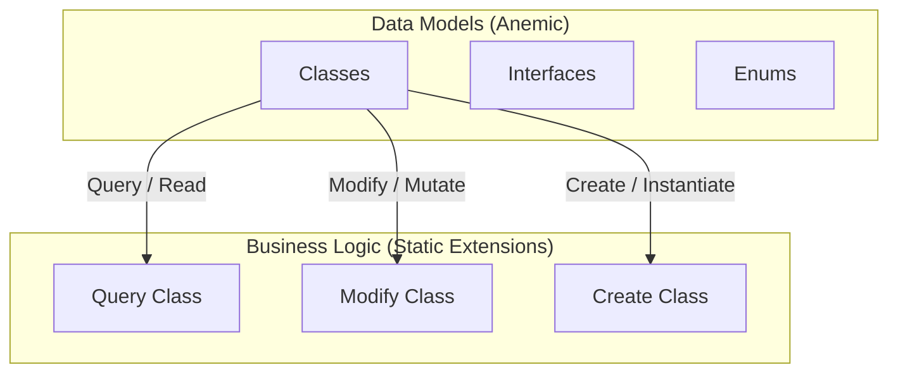

# DiGi.YOLO

**DiGi.YOLO** is a C# engineering and architectural software library suite designed for BIM and CAD integrations (such as Revit, RhinoCommon, Grasshopper, and Dynamo BIM).

---

## 🏗️ Project Architecture & Assemblies

The repository contains the following core components and assemblies:
* **[DiGi.YOLO](DiGi.YOLO)** (Path: `DiGi.YOLO\DiGi.YOLO`)

---

## 📐 Core Architectural Pattern (DiGi.Core Pattern)

This project strictly separates **Data Models** (anemic schemas) from **Business/Calculation Logic** (static extension methods). All new features must strictly follow this pattern.

### 1. Data Models (Classes, Interfaces, Enums)
* **Classes:** Place in the `/Classes` directory (Namespace: `[Project].Classes`). Keep them simple and lightweight (properties and basic constructors only). **Do NOT** put complex logic inside these classes.
* **Interfaces:** Place in the `/Interfaces` directory (Namespace: `[Project].Interfaces`).
* **Enums:** Place in the `/Enums` directory (Namespace: `[Project].Enums`).

### 2. Business Logic (Extension Methods)
ALL complex functionalities, including operations on classes, interfaces, and enums, MUST be implemented as **Extension Methods** inside static partial classes in `/Query`, `/Modify`, or `/Create` directories:
* **Query (Read/Extract):** Static partial class `Query` returning results based on a query without modifying the source object.
* **Modify (Update/Mutate):** Static partial class `Modify` modifying the state or properties of the existing object in place.
* **Create (Instantiate):** Static partial class `Create` instantiating and returning a new object.

---

## 💻 Coding Guidelines for Developers & AI Agents

To maintain codebase health, performance, and compatibility:

1. **English Only (Code & Comments):** All generated code and comments MUST be strictly in English.
2. **Explicit Typing Mandatory:** Never use implicit typing (`var`) unless it is strictly required by the compiler (declare all types explicitly).
   * **Target-Typed New (`new(...)`):** To avoid IDE0090 analyzer messages, always use target-typed new expressions (`new(...)`) instead of explicit type instantiation when the target type is explicitly declared (e.g., write `PointNode pointNode = new();` instead of `PointNode pointNode = new PointNode();`).
   * **Collection Expressions (`[]`):** To avoid IDE0028 analyzer messages ("Collection initialization can be simplified"), use collection expressions (`[]`) for initializing collections (e.g., write `List<int> numbers = [];` or `int[] array = [1, 2, 3];` instead of `new List<int>()` or `new int[] { 1, 2, 3 }`).
3. **Variable Naming Convention:** Variable and object names inside methods and functions MUST start with the object's type name formatted in camelCase (e.g. `PointNode pointNode_Base`). If a more specific name is needed, append a descriptive part after an underscore (`_`).
   * **Plural Naming for Collections:** For collections (such as `IEnumerable`, `List`, `Array`, `HashSet`, etc.), do NOT prefix them with the collection type name (e.g., do not use `listConditions` or `arrayGroups`). Instead, keep the full name of the object/type and append the plural suffix (e.g., use `FilterConditions` instead of `Conditions` or `listConditions`).
   * **Exception for Primitive/Simple Types:** For simple types like `double`, `string`, `int`, `bool`, etc., it is acceptable to exclude the type prefix and use standard camelCase naming.
4. **Zero Warnings & Messages:** The generated code MUST NOT produce any compiler warnings or analyzer messages in Visual Studio. Ensure strict adherence to nullability rules, proper parameter validations, and clean code principles.
5. **Language Version (C# 10+):** Code should target C# 10.0 or higher.

---

## 📝 XML Documentation Protocol

All public constructors, properties, methods, and enum values must be fully documented using XML comments to ensure accurate IntelliSense:

1. **Local Doc Generation:** The local documentation generation MUST be handled by the MCP tool named `lm_studio` (using the **Gemma 4** model if available).
2. **Single Summary Rule:** Strictly verify that each element (class, enum, method, property, field) receives exactly ONE `
` block.
3. **No Empty Lines:** Strictly avoid empty lines within XML documentation blocks (e.g., `/// ` lines containing only whitespace). Use `<para>` tags for paragraph breaks if needed.
4. **Signature Matching:** Ensure XML comments match method signatures exactly. Remove/update `<param>` tags for parameters that no longer exist, and document all new parameters, return types (`<returns>`), and type parameters (`<typeparam>`) to prevent compiler warnings (e.g., `CS1591`, `CS1573`).
5. **Ingest External Context:** Actively search for and utilize existing XML documentation files (`LibraryName.xml`) next to referenced DLLs in the project to ensure correct cross-referencing and precise descriptions.

---

## 🔁 Serialization Pattern (SerializableObject / ISerializableObject)

Classes under `/Classes` that require JSON persistence, cloning, or polymorphic deserialization MUST inherit `DiGi.Core.Classes.SerializableObject`. The mechanism is reflection-driven — never hand-write JSON parsing.

1. **Marker Interfaces:** Define a project-specific pair under `/Interfaces`, mirroring `DiGi.GIS.Interfaces.IGISObject` / `IGISSerializableObject`:
   * `I<Project>Object : DiGi.Core.Interfaces.IObject`
   * `I<Project>SerializableObject : I<Project>Object, DiGi.Core.Interfaces.ISerializableObject`
   Every serializable class in the project implements `I<Project>SerializableObject`.
2. **Fields:** Use `private readonly` fields, each tagged `[JsonInclude, JsonPropertyName(nameof(PublicProperty))]` — always reference the public property name via `nameof(...)`, never a string literal.
3. **Three Constructors (always in this order):**
   * **Primary** constructor (plain parameters, assigns fields) — no `base(...)` call.
   * **Copy** constructor `ClassName(ClassName? instance) : base(instance)` copying every field: primitives/strings by value; `List<T>` of primitives via `new List<T>(source)`; lists of nested `SerializableObject` items cloned element-by-element via `Core.Query.Clone(...)` (filtering nulls); a single nested reference via `field = Core.Query.Clone(source.field);`.
   * **JSON** constructor `ClassName(JsonObject? jsonObject) : base(jsonObject)` — empty body, pure delegation.
4. **Properties:** `[JsonIgnore]` get-only properties returning the backing field (serialization is handled by the field attribute, not the property).
5. **Project File:** Reference `DiGi.Core` (`<HintPath>..\..\DiGi.Core\bin\DiGi.Core.dll</HintPath>`) and the `System.Text.Json` `PackageReference` version used elsewhere in the solution.

---

## 🧪 Automatic Tests (xUnit)

Unit tests use the **xUnit** framework and must follow the same coding standards (English only, explicit typing, target-typed `new()`, type-prefixed variable names, zero warnings).

1. **Test Project:** Named `[ProjectName].xUnit` (e.g., `DiGi.Core.xUnit`).
2. **Partial `Facts` Class:** All test methods live in `public partial class Facts`, with files placed in the `/Facts` directory.
3. **Namespace:** Matches the test project namespace (e.g., `namespace DiGi.Core.xUnit`). `Xunit` is imported via global usings — do NOT add `using Xunit;`.
4. **Attributes & Naming:** Mark methods with `[Fact]` and name them after the class, property, or method under test (e.g., `Color()`, `PlanarIntersectionResult_Performance()`).
5. **XML Documentation:** Every test method has exactly one `
` block (no empty `///` lines; use `<para>` for paragraph breaks).
6. **Common Patterns:**
   * **Serialization round-trip:** Call `Query.SerializationCheck(instance)` (fully qualify as `Core.xUnit.Query.SerializationCheck(...)` from a different namespace). Add one `[Fact]` per `SerializableObject`-derived class.
   * **Tolerance boundaries:** Test cases exactly inside and exactly outside a tolerance (e.g., `1e-3 ± 1e-9`).
   * **Performance benchmarks:** Warm up to trigger JIT, measure with `System.Diagnostics.Stopwatch`, run on large datasets, and assert elapsed time stays below a threshold.

---

## 🔄 Branch Synchronization & Versioning Protocol

DevOps automation and branch versioning are controlled by strict versioning policies:

### Trigger Condition
- Protocol runs **ONLY** if the current active branch name matches the semantic versioning format of `*.*.*` exactly (e.g., `0.8.2`, `1.12.0`).
- If the branch contains suffixes/prefixes (e.g. `main`, `v0.8.2`, `0.8.2-beta`, `feature/xyz`), the protocol is skipped.

### Step-by-Step Workflow
1. **Sync with Main:** Merge the active version branch into `main` and resolve any diffs.
2. **Calculate Next Version (Patch Bump):** Increment the patch version (3rd digit) by exactly 1 (e.g., `0.8.2` becomes `0.8.3`).
3. **Create Branch:** Create a new branch named after the incremented version from the updated `main`.
4. **Update Project Version:** If a `Directory.Build.props` file exists in the repository, update the `<Major>`, `<Minor>`, and `<Build>` XML tags to match the new version. Commit this change to the new branch.
5. **Publish:** Push both the updated `main` branch and the new version branch to GitHub (`origin`).
